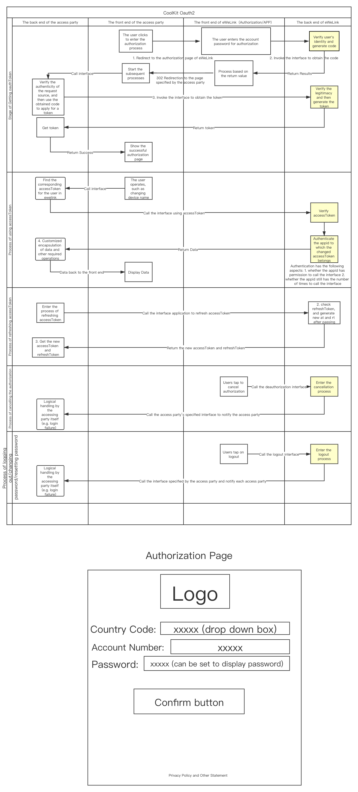
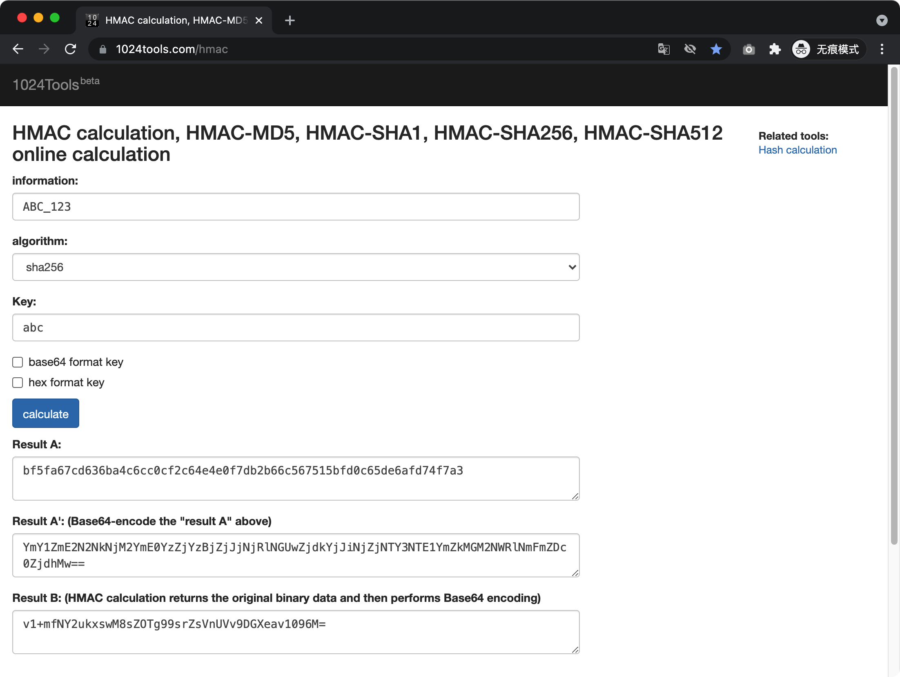

# OAuth 2.0

## Prepared Information

Before starting, you should provide us with the following information:

- Application Name (Project Name in English or Chinese)
- Applicant contact information (phone number or email)
- Redirect address (URL address to which users will redirect after successfully logging into their eWeLink account)
- Project Profile (a brief description of your project)

Log in [eWeLink Developer Center] (https://dev.ewelink.cc), submit your information for certification, and wait for the review result. Please note that the free APPID has some limitations, please refer to the [Requirements of Calling Interface and Description of APPID Permission (Important)] and [Standard of Charges] for more details.

After a successful review, create an application in Platform -> App Management, and you could use the relevant service and call the corresponding interface. Please note that it's only allowed to create one application now.

## Access Process

### Complete Flow Chart



### Code examples and test cases

[CoolKit OAuth Login Demo](https://github.com/coolkit-carl/eWeLinkOAuthLoginDemo)

[CoolKit OAuth2.0 Postman Demo](https://raw.githubusercontent.com/CoolKit-Technologies/eWeLink-API/main/media/files/CoolKit_OAuth2.0_Postman_Demo.zip)

Import [Postman](https://www.postman.com/downloads/) and fill in your application information in the environment file.

Interface call frequency limit: the recommended interval is greater than or equal to 1 second

### Authorization Page Description

URL: [https://c2ccdn.coolkit.cc/oauth/index.html](https://c2ccdn.coolkit.cc/oauth/index.html)

The text language of this authorization page is displayed based on：[Navigator.language](https://developer.mozilla.org/en-US/docs/Web/API/NavigatorLanguage/language)

Request method: GET

Query parameters：

| Parameters    | Allows empty |                                                                                                                                          Description                                                                                                                                           |
| ------------- | -----------: | :--------------------------------------------------------------------------------------------------------------------------------------------------------------------------------------------------------------------------------------------------------------------------------------------: |
| clientId      |            N |                                                                                                                         APPID of the accessing party, apply to CoolKit                                                                                                                         |
| seq           |            N |                                                                                                                      Timestamp of this request, accurate to milliseconds.                                                                                                                      |
| authorization |            N |                                                                                                                          Signature, see below for specific algorithms                                                                                                                          |
| redirectUrl   |            N |                                                                                                                      Redirect Url after obtaining the authorization code                                                                                                                       |
| grantType     |            N |                                                                                      Authorization type, only one fixed parameter can be passed (That is, only authorization code is supported currently)                                                                                      |
| state         |            N | Request ID, accessing parties use this variable tNo avoid cross-domain forgery problems, the server of eWeLink requires that the value must be passed, but does not check the specific value, you can pass the ID of the user of your own platform, and it will be passed back when redirecting |
| nonce         |            N |              8-digit alphanumeric random string(Both upper and lower case alphanumerics are allowed)           |
| showQRCode    |            Y |    Whether to display the QR code pop-up window. If true, the QR code pop-up window is displayed; otherwise, the account password input box is displayed    |

authorization signature calculation method within parameters:

Algorithm: HMAC（Hash-based Message Authentication Code）SHA256

Key: {clientSecret}

Message: {clientId}\_{seq}

Result: HMAC calculation returns the original binary data and then Base64 encoding

Example: Assume here: clientId = ABC，seq = 123，clientSecret = abc

The actual calculated signature is: v1+mfNY2ukxswM8sZOTg99srZsVnUVv9DGXeav1096M=



The result of the calculation is filled in the authorization parameter

Code example:

```JavaScript
// NodeJS
const crypto = require('crypto');
const clientId = 'ABC';
const seq = '123';
const clientSecret = 'abc';
const buffer = Buffer.from(`${clientId}_${seq}`, "utf-8");
const sign = crypto.createHmac("sha256", clientSecret).update(buffer).digest("base64");
console.log(sign);
// v1+mfNY2ukxswM8sZOTg99srZsVnUVv9DGXeav1096M=
```

```Python
# Python
import hashlib
import hmac
import base64

def makeSign(key:str, message:str) -> str:
    return (base64.b64encode(hmac.new(key.encode(), message.encode(), digestmod=hashlib.sha256).digest())).decode()

sign = makeSign("abc","ABC_123")
print(sign)
# v1+mfNY2ukxswM8sZOTg99srZsVnUVv9DGXeav1096M=
```

Put the above parameters into the query to get the final authorization page address:

The accessing party directs the user to open the authorization page address, for example:

[https://c2ccdn.coolkit.cc/oauth/index.html?state=XXX&clientId=XXX&authorization=XXX&seq=123&redirectUrl=https://XXX.com/redirect.html&nonce=zt123456&grantType=authorization_code&showQRCode=false](https://c2ccdn.coolkit.cc/oauth/index.html?state=XXX&clientId=XXX&authorization=XXX&seq=123&redirectUrl=https://XXX.com/redirect.html&nonce=zt123456&grantType=authorization_code&showQRCode=false)

After the user fills in the account password and clicks login successfully, the page will jump to the redirect address URL you added before and carries the parameters code, regin, state, and the request method is GET.

Example：{Your redirectUrl}?code=95bcf41b-3397-46da-886f-fdc852de84ca&region=as&state=10011

**Code is valid for 30 second.** When it expires, it returns:

    {"error": 405, "msg": "invalid code", "data": {}}

After the accessing party gets the code, requesting the 'POST@/v2/user/oauth/token' interface of corresponding area to get the accessToken to complete the binding process, which can then be used to get the user's device information and control the device.

## v2 Interface Description

The APIs in this document applies HTTPS protocol, in which the client sends data with UTF-8 encoding and in json format.

### Requirements of Calling Interface (Important):

- Once the user has successfully logged into the eWeLink account authorization page, your platform should call [Get Thing List] Interface (GET@/v2/device/thing) one time, sync the device list, and display the correct device type according to the UIID(UI's ID).
- The interval of a single IP calling the all Interface should be greater than or equal to 500ms, with no more than 300 calls in 5 minutes. If you control our devices via WebSocket, please keep in mind that every user is not allowed to log in and log out repeatedly for a short period of time (Send userOnline command). Otherwise, your IP will be blocked and terminated by the server if the userOnline command are sent too many times for a short period.
- Partners who has the business certification and enterprises that purchased the APPID have the access to [Paid APPID] to call all Interfaces without limitations for the total number of calls now but there are the same regulations for calling frequency as the above second point.
- Developers who log in via eWeLink Developer Platform and complete the certification can use the [ Free APPID] to call OAuth2.0's relevant interface, and the total number of requests for all interfaces in each region is limited to 50,000 times per month. If the limit is exceeded, the interface returns an HTTP status code of 403 error (not the returned parameter)or the interface returns error 412. The quota can continue to be used after the next month's quota refresh. If you want to lift the limit immediately, you need to pay for an upgrade to Enterprise Edition and you can contact [bd@coolkit.cn](mailto:bd@coolkit.cn) by email.
- For APPID applied by enterprises and personal developers, Currently open some authorized brands of equipment, as well as mainstream equipment types (which will be released in batches soon, please stay tuned). If you have demand for other complex device types or new device types, please contact our relevant staff or email us via [bd@coolkit.cn](mailto:bd@coolkit.cn).

### v2 Interface domain name

- Mainland China: https://cn-apia.coolkit.cn
- Asia: https://as-apia.coolkit.cc
- Americas: https://us-apia.coolkit.cc
- Europe: https://eu-apia.coolkit.cc

### v2 Interface General parameters

| **Http Header** | **Allows Empty**                                        | **Description**                                                                                                                                                                                                 |
| :-------------- | :------------------------------------------------------ | :-------------------------------------------------------------------------------------------------------------------------------------------------------------------------------------------------------------- |
| X-CK-Appid      | The interface under the [User] category cannot be empty | APPID, the APP's logo, the credentials that need to be paid for                                                                                                                                                 |
| X-CK-Nonce      | Y                                                       | A combination of 8 uppercase or lowercase letters and numbers. The client should try to use random strings to facilitate joint debugging with the server.                                                       |
| Authorization   | N                                                       | API call credentials, see below Signature Rules for the calculation method                                                                                                                                      |
| Content-Type    | PUT and POST requests are not allowed to be empty       | Fixed as "application/json" or "application/json; charset=utf-8"                                                                                                                                                |
| Host            | N                                                       | Most HTTP clients will automatically add this field. If not, it must be explicitly specified by the code. The value is the corresponding interface domain name, such as: cn-apia.coolkit.cn, us-apia.coolkit.cc |

### v2 Interface Signature Rules

Calling all interfaces before login (including the login interface) requires signature calculation, and the signature value is placed in the Authorization parameter of the request header.

Example: Authorization: Sign QtKh6EnKoNmPnv17Ump3b/6r2hjojWb4nqSt4lnyj2U=

Calculate the signature:

Use the "app secret" as the key to generate the HMAC-SHA256 signature of the signed string, and set the Base64-encoded signature to Authorization.

- GET Request:

Order all parameters (Except sign) alphabetically based on the names of parameters and concatenate them with &:

```
appid=McFJj4Noke1mGDZCR1QarGW7P9Ycp0Vr&deviceid=1000012345&nonce=2323dfgh&ts=1558004249
```

- POST request:

The string to be encrypted is the entire body of the json data (http body). Take the login interface as an example.

Example:

```json
{ "email": "1234@gmail.com", "password": "12345678", "countryCode": "+1" }
```

**Notes:**

The value of phoneNumber needs to add country code such as: +86

phoneNumber or email, only one of them need to be passed. In China mainland only "phoneNumber" can be passed. In the rest of Asia region, "phoneNumber" or "email" can be passed, and "email" can be passed in Europe and America.

Calculating the signature:

Use the "app secret" as the key to generate the HMAC-SHA256 signature of the signed string, and set the Base64-encoded signature to Authorization.

**Signature Calculation**

**Examples of Sha256 encryption functions in 15 programming languages:**
[https://www.jokecamp.com/blog/examples-of-creating-base64-hashes-using-hmac-sha256-in-different-languages/](https://www.jokecamp.com/blog/examples-of-creating-base64-hashes-using-hmac-sha256-in-different-languages/)

[https://1024tools.com/hmac](https://1024tools.com/hmac)


- Digital Signature Algorithm Demo ①: Take the login interface as an example (Method: POST).

```JavaScript
// node.js
var crypto = require('crypto');
let appsecret="OdPuCZ4PkPPi0rVKRVcGmll2NM6vVk0c";
let body={"email":"1234@gmail.com","password":"12345678","countryCode":"+1"}
let buffer = Buffer.from(JSON.stringify(body),"utf-8" );
let theSign = crypto.createHmac('sha256', appsecret).update(buffer).digest('base64')
// or let theSign = CryptoJS.enc.Base64.stringify(CryptoJS.HmacSHA256(buffer, appsecret));
console.log(theSign)
// ttZ/gluzqrafvGonjMD20p4//arW6KoZKbo1SOMEzCA=
```

- Digital Signature Algorithm Demo ②:

```Python
# Python
import hashlib
import hmac
import base64
import json

def makeSign(key, message):
    j = hmac.new(key.encode(), message.encode(), digestmod=hashlib.sha256)
    return (base64.b64encode(j.digest())).decode()

def main():
    data = {
        "email":"1234@gmail.com",
        "password":"12345678",
        "countryCode":"+1"
    }
    message = json.dumps(data)
    Sign = makeSign(key='OdPuCZ4PkPPi0rVKRVcGmll2NM6vVk0c', message=message)
    print(Sign)
    # cE/Wl57Ithy21Elieq5wFsYwJWl2IrkBxlmuCnwI73c=

if __name__ == "__main__":
    main()
```

Notes: Due to the different character sequence, the signature will be different, which is normal case.

You can put the parameters of the demo in your own signature algorithm. If the calculated signature value is consistent with the provided signature value, means that the signature algorithm has passed.

### v2 Interface Interface response format

The data returned by all interfaces of this protocol uses UTF-8 encoding and json format. The data format is as follows

| **Name** | **Type** | **Allows Empty** | **Description**                                                                                                                                                                           |
| :------- | :------- | :--------------- | :---------------------------------------------------------------------------------------------------------------------------------------------------------------------------------------- |
| error    | Int      | N                | Error code, 0 means no error. Common error code within 1000. Please refer to the [General Error Code] section of this agreement. Error code above 1000 is defined by different interfaces |
| data     | Object   | N                | Interface data                                                                                                                                                                            |
| msg      | String   | N                | Error information, when error=0, it is an empty string "". Other codes are returned based on different interfaces.                                                                        |

Example 1: Success response

```json
{
  "error": 0,
  "msg": "",
  "data": {
    "data1": "xxx",
    "data2": "yyy"
  }
}
```

Example 2: Error response

```json
{
  "error": 403,
  "msg": "api not found",
  "data": {}
}
```

## V2 Interface Error Code

| **error code** | **description**                                                                                                                                                                                               |
| :------------- | :------------------------------------------------------------------------------------------------------------------------------------------------------------------------------------------------------------ |
| 400            | parameter error, usually the parameter required by the interface is missing, or the type or value of the parameter is wrong                                                                                   |
| 401            | access token authentication error. Usually, the account is logged in by others, resulting in the invalidation of the current access token                                                                     |
| 402            | access token expired                                                                                                                                                                                          |
| 403            | the interface cannot be found, usually the interface URL is written incorrectly                                                                                                                               |
| 405            | the resource cannot be found. Usually, the necessary data records cannot be found in the back-end database                                                                                                    |
| 406            | reject the operation. Usually, the current user does not have permission to operate the specified resource                                                                                                    |
| 407            | appid has no operation permission |
| 412        | APPID calls exceed the limit, you can upgrade to the enterprise version by contacting bd@coolkit.cn. |
| 500            | server internal error, usually the server program error                                                                                                                                                       |
| 4002       | Device control failure (Check control parameter transmission or device online status). |
| 30022          | the device is offline and the operation fails. It will appear in batch updating the device status                                                                                                             |

## v2 Interface list

**Postman Demo download：[Click download](https://raw.githubusercontent.com/CoolKit-Technologies/eWeLink-API/main/media/files/CoolKit_OAuth2.0_Postman_Demo.zip)**

Import [Postman](https://www.postman.com/downloads/) and fill in your application information in the environment file.

Interface call frequency limit: the recommended interval is greater than or equal to 1 second

### Apply for third-party authorization credentials interface

URL：/v2/user/oauth/token

Request method: POST

Request parameters:

| **Name**    | **Type** | **Allows Empty** | **Description**                       |
| ----------- | -------- | ---------------- | ------------------------------------- |
| code        | String   | N                | Authorization code                    |
| redirectUrl | String   | N                | Redirect address                      |
| grantType   | String   | N                | Currently fixed to authorization_code |

Response data parameters:

| **Name**      | **Type** | **Allows Empty** | **Description**                                                                  |
| ------------- | -------- | ---------------- | -------------------------------------------------------------------------------- |
| accessToken   | String   | N                | Authorization Credentials                                                        |
| atExpiredTime | Int      | N                | Expiration timestamp (milliseconds) of authorization Credentials                 |
| refreshToken  | String   | N                | Refresh the certificate of the authorization credentials                         |
| rtExpiredTime | Int      | N                | Refresh the expiration timestamp (milliseconds) of the authorization credentials |

### Token Refresh

URL: /v2/user/refresh

Request method: POST

Request Parameters:

| **Name** | **Type** | **Allows Empty** | **Description** |
| :------- | :------- | :--------------- | :-------------- |
| rt       | String   | N                | Refresh Token   |

Response data parameters:

| **Name** | **Type** | **Allows Empty** | **Description** |
| :------- | :------- | :--------------- | :-------------- |
| at       | String   | N                | Access Token, valid for 30 days|
| rt       | String   | N                | Refresh Token, valid for 60 days|

### Unbind third party accounts

Note: It is expected to be released before September 9, 2021

URL: /v2/user/oauth/token

Request method: DELETE

Request parameters: nUnbindone

Response data parameters: none

### Get home and room List

URL: /v2/family

Request method: GET

Request parameters:

| **Name** | **Type** | **Allows Empty** | **Description**                                        |
| :------- | :------- | :--------------- | :----------------------------------------------------- |
| lang     | String   | Y                | cn returns Chinese, and en returns English, default en |

Response data parameters:

| **Name**        | **Type** | **Allows Empty** | **Description**            |
| :-------------- | :------- | :--------------- | :------------------------- |
| familyList      | Array    | N                | Home list                  |
| currentFamilyId | String   | N                | The ID of the current home |

FamilyList item description:

| **Name** | **Type** | **Allows Empty** | **Description**                                         |
| :------- | :------- | :--------------- | :------------------------------------------------------ |
| id       | String   | N                | Home ID                                                 |
| apikey   | String   | N                | User apikey                                             |
| name     | String   | N                | Home name                                               |
| index    | Int      | N                | Sequence number of the home, which could be negative.   |
| roomList | Array    | Y                | Room list                                               |

RoomList item description:

| **Name** | **Type** | **Allows Empty** | **Description**                                       |
| :------- | :------- | :--------------- | :---------------------------------------------------- |
| id       | String   | N                | Room ID                                               |
| name     | String   | N                | Room name                                             |
| index    | Int      | N                | Sequence number of the room, which could be negative. |

### Get Thing list

Note:

- When the user device (total parameter) exceeds 30, you need to set the beginIndex parameter to get it in pages, otherwise too much data will be acquired and the server will return timeout errors such as 500.
- The total parameter returned may be greater than the total amount of device data returned, which indicates that not all device data has been obtained. The specific reason is: at present, we only authorize the brands of Sonoff and CoolKit. The brands of other manufacturers can only be used after signing a letter of authorization with the help of our business colleagues. See the chapter "Requirements of Calling Interface (Important)" for details.

URL: /v2/device/thing

Request method: GET

Description: Thing could be

- a device (owned by yourself or shared by others)
- a device group

Request parameters:

| **Name**   | **Type** | **Allows Empty** | **Description**                                                                                            |
| :--------- | :------- | :--------------- | :--------------------------------------------------------------------------------------------------------- |
| lang       | String   | Y                | cn returns Chinese, and en returns English, default en                                                     |
| familyid   | String   | Y                | Home ID. Default is the current home                                                                       |
| num        | Int      | Y                | The number of things to get. The default value, 30 will be used if not offered. 0 means to get all things. |
| beginIndex | Int      | Y                | The index of the item to begin to get. The default value,-9999999, will be used if not                     |

Response data parameters:

| **Name**  | **Type** | **Allows Empty** | **Description**                                |
| :-------- | :------- | :--------------- | :--------------------------------------------- |
| thingList | Array    | N                | Thing list                                     |
| total     | Int      | N                | Total number of things (device + device group) |

List items of thingList description:

| **Name** | **Type** | **Allows Empty** | **Description**                                                                                                                                                                                                                                        |
| :------- | :------- | :--------------- | :----------------------------------------------------------------------------------------------------------------------------------------------------------------------------------------------------------------------------------------------------- |
| itemType | Int      | N                | Item type 1=user’s own device 2=device shared by others 3=user's own group                                                                                                                                                                             |
| itemData | Object   | N                | The structures of this field differs from itemType. When itemType is 1 or 2, refer to the description for device list item in [Get the list of all devices] interface. For 3, see the description of groupList item in the [Get group list] interface. |
| index    | Int      | N                | Sequence number                                                                                                                                                                                                                                        |

item description:

| **Name**     | **Type**        | **Allows Empty** | **Description**                                                                                           |
| :----------- | :-------------- | :--------------- | :-------------------------------------------------------------------------------------------------------- |
| name         | String          | N                | Device name                                                                                               |
| deviceid     | String          | N                | Device ID                                                                                                 |
| apikey       | String          | N                | apikey of the user to which the device belongs                                                            |
| extra        | Object          | N                | The contents of the factoryDevice's extra field                                                           |
| brandName    | String          | N                | Brand name                                                                                                |
| brandLogo    | String          | N                | Brand logo url                                                                                            |
| showBrand    | Boolean         | N                | Whether to display the brand                                                                              |
| productModel | String          | N                | Product model name                                                                                        |
| devGroups    | Array\<Object\> |  Y               | list of all the groups the device is in                                                                   |
| tags         | Object          | Y                | Tag object, which stores a custom string, and the server is only responsible for transparent transmission |
| devConfig    | Object          | Y                | Device configuration from deviceConfig in the factorydevices list                                         |
| settings     | Object          | Y                | User settings. Please refer to [Change device settings] interface description.                            |
| family       | Object          | N                | Home of the device                                                                                        |
| sharedBy     | Object          | Y                | If the device is shared by others, it will have this attribute.                                           |
| shareTo      | Array\<Object\> | Y                | The list of shared user with whom the device has been shared                                              |
| devicekey    | String          | N                | Factory apikey of the device                                                                              |
| online       | Boolean         | N                | Online status                                                                                             |
| params       | Object          | Y                | Status attributes of device                                                                               |
| gsmInfoData  | Object          | Y                | Sim card status object of GSM device                                                                      |

extra description:

| **Name**     | **Type** | **Allows Empty** | **Description**                                        |
| :----------- | :------- | :--------------- | :----------------------------------------------------- | --- |
| model        | String   | N                | Firmware name                                          |
| ui           | String   | N                | UI name                                                |
| uiid         | Int      | N                | UI ID                                                  |
| description  | String   | N                | Notes on factory information, usually the order number |
| manufacturer | String   | N                | Manufacturer                                           |
| mac          | String   | N                | mac address                                            |
| apmac        | String   | N                | p mac address(device hotspot address)）                | a   |
| modelInfo    | String   | N                | Product model ID                                       |
| brandId      | String   | N                | Brand ID                                               |

settings description:

| **Name**    | **Type** | **Allows Empty** | **Description**                                                                            |
| :---------- | :------- | :--------------- | :----------------------------------------------------------------------------------------- |
| opsNotify   | Int      | Y                | Whether to notify the user of device status change (default 0) 0=no 1=yes                  |
| opsHistory  | Int      | Y                | Whether to save activity logs of the device (default 1) 0=no 1=yes                         |
| alarmNotify | Int      | Y                | Whether to send alerts from sensors or alarms to the user (default 1) 0=Do not send 1=Send |

devGroups description:

| **Name** | **Type** | **Allows Empty** | **Description**           |
| :------- | :------- | :--------------- | :------------------------ |
| type     | Int      | N                | 1 represents device group |
| groupId  | String   | N                | id of the groups          |

sharedBy list item description:

| **Name**    | **Type** | **Allows Empty** | **Description**                                                                                              |
| :---------- | :------- | :--------------- | :----------------------------------------------------------------------------------------------------------- |
| apikey      | String   | N                | Unique identity of the user to which the device belongs (currently using symmetric encryption of the string) |
| permit      | Int      | N                | User's permission value, default is 0                                                                        |
| phoneNumber | String   | Y                | Mobile number of the device owner                                                                            |
| email       | String   | Y                | Email of the device owner                                                                                    |
| nickname    | String   | Y                | Nickname of the device owner                                                                                 |
| comment     | String   | Y                | Note of sharing                                                                                              |
| shareTime   | Long     | Y                | UTC standard time, in milliseconds, used to display sorting on the client                                    |

shareTo list item description:

| **Name**    | **Type** | **Allows Empty** | **Description**                                                                                                             |
| :---------- | :------- | :--------------- | :-------------------------------------------------------------------------------------------------------------------------- | --------------------------------------------------------------------------------------------------------------------------- |
| permit      | Int      | N                | User's permission value, default is 0                                                                                       | User's permission value, default is 0                                                                                       |
| apikey      | String   | N                | ID identification of the user account shared by the receiving device (symmetric encryption of the string is currently used) | ID identification of the user account shared by the receiving device (symmetric encryption of the string is currently used) |
| phoneNumber | String   | Y                | Mobile number of the device owner                                                                                           |
| email       | String   | Y                | Email of the device owner                                                                                                   |
| nickname    | String   | Y                | Nickname of the device owner                                                                                                |
| comment     | String   | Y                | Note of sharing                                                                                                             |
| shareTime   | Long     | Y                | UTC standard time, in milliseconds, used to display sorting on the client                                                   |

：
devConfig description (camera)：

| **Name**      | **Type** | **Allows Empty** | **Description** |
| :------------ | :------- | :--------------- | :-------------- |
| p2pServerName | String   | Y                | Server Name     |
| p2pAccout     | String   | Y                | Account         |
| p2pLicense    | String   | Y                | license         |

family description：

| **Name** | **Type** | **Allows Empty** | **Description**                                                     |
| :------- | :------- | :--------------- | :------------------------------------------------------------------ |
| familyid | String   | N                | Home ID                                                             |
| index    | Int      | N                | The sequence number of the device, which could be a negative number |
| roomid   | String   | Y                | Room ID of the device                                               |

### Get Specified Things list

URL: /v2/device/thing

Request method: POST

Request parameters:

| **Name**  | **Type** | **Allows Empty** | **Description**                                                                                   |
| :-------- | :------- | :--------------- | :------------------------------------------------------------------------------------------------ |
| thingList | Array    | N                | The total number of things in the list to get must be greater than 0 and less than or equal to 10 |

thingList items description:

| **Name** | **Type** | **Allows Empty** | **Description**                                                                                                             |
| :------- | :------- | :--------------- | :-------------------------------------------------------------------------------------------------------------------------- |
| itemType | Int      | N                | Item type 1=user’s own device 2=device shared by others 3=user's own group                                                  |
| id       | String   | N                | The ID of the corresponding thing. When itemType is 1 or 2, thing ID means deviceid. For 3 or 4, this field means group ID. |

Response data parameters:

| **Name**  | **Type** | **Allows Empty** | **Description**                                                 |
| :-------- | :------- | :--------------- | :-------------------------------------------------------------- |
| thingList | Array    | N                | Thing list. Please refer to the description in [Get Thing list] |

### Get Device or Group Status

URL: /v2/device/thing/status

Request method: GET

Request parameters:

| **Name** | **Type** | **Allows Empty** | **Description**                                    |
| :------- | :------- | :--------------- | :------------------------------------------------- |
| type     | Int      | N                | Whether to get device or group. 1=device 2=group   |
| id       | String   | N                | When type=1, this means deviceid. For 2, group ID. |
| params   | String   | Y                | Status parameters to be obtained                   |

Params description:

The caller can specify to obtain only the status parameters that are of interest, which should be separated by "|", and then perform url conversion.

Example: You want to get the switch and light status of a device.

1.Create the string switch|light

2.Perform url conversion on the string of (1) to get the string 'switch%7Clight', which is the value of the params to send to the interface.

If you want to get all the status of the device or group, the params should be empty.

Response data parameters:

| **Name** | **Type** | **Allows Empty** | **Description**                   |
| :------- | :------- | :--------------- | :-------------------------------- |
| params   | Object   | N                | Device or group status attributes |

### Update the Status of a Device or Group

URL: /v2/device/thing/status

Request method: POST

Request parameters:

| **Name** | **Type** | **Allows Empty** | **Description**                                    |
| :------- | :------- | :--------------- | :------------------------------------------------- |
| type     | Int      | N                | To update a device or a group. 1=device 2=group    |
| id       | String   | N                | When type=1, this means deviceid. For 2, group ID. |
| params   | Object   | N                | The status parameters to be updated                |

params description:

- When you update a device, a control command will be sent to the device. If the device is offline or sending fails, an error will be returned.
- When you update a group, the server will send a control command to all the devices in the group and ignore any devices being offline or sending failure.

Response data parameter: None

### Update the Status of Multiple Devices or Groups

Description: This interface will actually send control commands directly to the device, which is dedicated to devices that cannot be updated via a persistent connection.

URL: /v2/device/thing/batch-status

Request method: POST

Request parameters:

| **Name**  | **Type**        | **Allows Empty** | **Description**                                                                                                                                                                                    |
| :-------- | :-------------- | :--------------- | :------------------------------------------------------------------------------------------------------------------------------------------------------------------------------------------------- |
| thingList | Array\<Object\> | N                | The list of things to update, of which the length should be greater than 0 and less than or equal to 10. The client must ensure that the ID in the list are unique, otherwise an error will occur. |
| timeout   | Int             | Y                | The time to wait for all devices to respond, in milliseconds, 0 <= timeout <= 8000. if not offered, the default is 0, which means to respond immediately.                                          |

item in the thingList’ description:

| **Name** | **Type** | **Allows Empty** | **Description**                                    |
| :------- | :------- | :--------------- | :------------------------------------------------- |
| type     | Int      | N                | To update devices or groups. 1=device 2=group      |
| id       | String   | N                | When type=1, this means deviceid. For 2, group ID. |
| params   | Object   | N                | Status parameter to be updated                     |

Response data parameter：

| **Name** | **Type**        | **Allows Empty** | **Description**                   |
| :------- | :-------------- | :--------------- | :-------------------------------- |
| respList | Array\<Object\> | N                | List of responses from all things |

item in the respList description:

| **Name** | **Type** | **Allows Empty** | **Description**                                                                                                                   |
| :------- | :------- | :--------------- | :-------------------------------------------------------------------------------------------------------------------------------- |
| type     | Int      | N                | To update devices or groups. 1=device 2=group                                                                                     |
| id       | String   | N                | When type=1, this means deviceid. For 2, group ID.                                                                                |
| error    | Int      | N                | Response error code, 0 means no error. If type=2, error is fixed to 0. If timeout is 0 when calling, error is fixed to 0 as well. |

## Real Time Control Device

Complete process description:

The client (APP, applet, web page or other) requests to allocate a service interface and obtain the IP address + port for establishing the websocket.

Splicing WSS address: wss:// {domain or IP}:{port}/api/ws

After the connection is established, send websocket: handshake related parameters. After passing the authentication, the connection is successfully established, and then you can issue control instructions and report information to the receiving device or server.

### HTTP: DispatchService (APP)

Distributed address for persistent connection used by the app

- Mainland China: [https://cn-dispa.coolkit.cn/dispatch/app ](https://cn-dispa.coolkit.cn/dispatch/app)
- Americas: [https://us-dispa.coolkit.cc/dispatch/app ](https://us-dispa.coolkit.cc/dispatch/app)
- Europe: [https://eu-dispa.coolkit.cc/dispatch/app ](https://eu-dispa.coolkit.cc/dispatch/app)
- Asia: [https://as-dispa.coolkit.cc/dispatch/app ](https://as-dispa.coolkit.cc/dispatch/app)

Request method: GET

Authorization parameter: Token

Request parameters: none

Note: Please note that the domain name used for mainland China and the test region is coolkit **.cn** , while the domain name used in other regions is coolkit **.cc**

**Response parameters:**

| Name   | Type   | Allows empty | Description                                                                                                                                                                                                                                                                                                                      |
| :----- | :----- | :----------- | :------------------------------------------------------------------------------------------------------------------------------------------------------------------------------------------------------------------------------------------------------------------------------------------------------------------------------- |
| IP     | string | N            | The IP address of the server for persistent connection                                                                                                                                                                                                                                                                           |
| port   | number | N            | The port of the server for persistent connection                                                                                                                                                                                                                                                                                 |
| domain | string | N            | The domain name of the persistent connection server.Currently only the app will return the domain name.The android client should choose to establish a long connection by IP, which can avoid the problems caused by DNS resolution. The js version of the client cannot skip the certificate check, so only the IP can be used. |
| error  | number | N            | "error:0": success                                                                                                                                                                                                                                                                                                               |
| reason | string | N            | "OK": success                                                                                                                                                                                                                                                                                                                    |

Error code

0: success

**Response example:**

```json
{
  "port": 8080,
  "IP": "52.80.19.131",
  "reason": "ok",
  "domain": "cn-pconnect2.coolkit.cc",
  "error": 0
}
```

### WebSocket: handshake

The authorization happens when connection is established. There are two types of handshakes, respectively on client and device. This one is on the client.

**Notes:**

When establishing a wss connection, the client will verify whether the accessed domain name is consistent with the domain name of the certificate. Therefore, by default, if you use IP to establish a connection, an error will be returned, causing the connection to fail.

Hence, it is recommended that the client skip the domain name verification for the certificate (both android and java can do that). If you cannot skip the certificate verification, you can try to establish a wss connection via IP.

Obtain the persistent connection address to be connected from [HTTP: Dispatchservice], and concatenate it into: "wss://IP:port/api/ws", so as to establish a persistent connection. After the handshake is successful, you need to send the string "ping" to the server periodically (see the hbInterval field for the interval) to keep the heartbeat, otherwise the device will be forced to go offline by the server.

Its parameters are as follows,

| Name      | Type   | Allows empty | Description                                       |
| :-------- | :----- | :----------- | :------------------------------------------------ |
| action    | string | N            | Fixed parameter: userOnline                       |
| at        | string | N            | AT obtained from the login interface              |
| apikey    | string | N            | User apikey (obtainable from the login interface) |
| appid     | string | N            | APPID                                             |
| nonce     | string | N            | 8-digit alphanumeric random string                |
| ts        | number | Y            | Timestamp accurate to seconds                     |
| userAgent | string | N            | Fixed parameter: app                              |
| sequence  | string | N            | Timestamp accurate to milliseconds                |
| version   | number | N            | Interface version: 8                              |

Example:

```json
{
  "action": "userOnline",
  "version": 8,
  "ts": 1571141259,
  "at": "AT obtained by login interface",
  "userAgent": "app",
  "apikey": "User APIKEY obtained by login interface",
  "appid": "McFJj4Noke1mGDZCR1QarGW7P9Ycp0Vr",
  "nonce": "2plz69ax",
  "sequence": "millisecond-level timestamp, example: 1571141530100"
}
// Need to remove space before compression, and do not incldue extra commas
```

**Response parameters:**

| Name     | Type   | Allows empty | Description                        |
| :------- | :----- | :----------- | :--------------------------------- |
| error    | number | N            | Error code                         |
| apikey   | string | N            | User apikey                        |
| config   | string | Y            | Configuration                      |
| sequence | string | N            | Timestamp accurate to milliseconds |

Config description:

| Name       | Type   | Allows empty | Description                                                                                                                                                                                               |
| :--------- | :----- | :----------- | :-------------------------------------------------------------------------------------------------------------------------------------------------------------------------------------------------------- |
| hb         | number | Y            | Heartbeat, whether to send heartbeats to keep alive.0: No, 1: Yes                                                                                                                                         |
| hbInterval | number | Y            | Heartbeat interval, in seconds. The client needs to add 7 to this value as the interval to send keep the ping heartbeat alive.If it is not offered, the heartbeat interval will be 90 seconds by default. |

Error code

0: success

**Response example:**

```json
{
  "error": 0,
  "apikey": "User APIKEY",
  "config": {
    "hb": 1,
    "hbInterval": 145
  },
  "sequence": "Millisecond-level timestamp , Example: 1571141530100" // Same as sent
}
```

### WebSocket: device online and offline notification (passively received by the app)

When the server detects a device going online or offline, it will send a notification to the app. The notification is sent to the app passively. There is no need for the client to request actively.

Parameters:

| Name     | Type   | Allows empty | Description                                                                                                                                          |
| :------- | :----- | :----------- | :--------------------------------------------------------------------------------------------------------------------------------------------------- |
| nonce    | string | N            | 8-digit alphanumeric random string                                                                                                                   |
| apikey   | string | N            | Current User apikey (available from the login interface) or the apikey of the master account (available from the interface for obtaining Thing list) |
| deviceid | string | N            | Device ID                                                                                                                                            |
| action   | string | N            | Fixed parameter: sysmsg                                                                                                                              |
| params   | object | N            | Parameters: {k:v}                                                                                                                                    |
| ts       | number | Y            | Timestamp accurate to seconds                                                                                                                        |

Example:

```json
{
  "action": "sysmsg",
  "deviceid": "1000000001",
  "apikey": "Current user APIKEY",
  "ts": 15452192511,
  "params": {
    "online": false
  }
}
```

### WebSocket: Update device status

**After device status changes and sends the 'update' command, as long as the client has a persistent connection, it will receive a notification. Therefore, it is recommended that the client keep the persistent connection alive to monitor device status or send queries to check the status of a single device, instead of checking device status periodically by requesting the HTTP interface, to reduce the burden on the server.**

This is to change the statuses of a device, such as timers, sharing, on/off, etc.

Parameters:

| Name      | Type   | Allows empty | Description                                                                                                                                                                                 |
| :-------- | :----- | :----------- | :------------------------------------------------------------------------------------------------------------------------------------------------------------------------------------------ |
| action    | string | N            | Fixed parameter: update                                                                                                                                                                     |
| apikey    | string | N            | Current user apikey (available from the login interface) or the apikey of the master account (available from the interface for obtaining Thing list)                                        |
| selfApikey    | string | Y       | Receiver's apikey. Required when the receiver updates its device status. It cannot be empty. |
| deviceid  | string | N            | Device ID                                                                                                                                                                                   |
| params    | object | N            | The server applies transparent transmission for the params, which may be an object or an array of objects. Just make sure you send the parameters of all the statuses you desire to change. |
| userAgent | string | N            | app or device                                                                                                                                                                               |
| sequence  | string | N            | Timestamp accurate to milliseconds                                                                                                                                                          |

Example:

```json
{
  "action": "update",
  "deviceid": "100000001",
  "apikey": "Current user APIKEY",
  "userAgent": "app",
  "sequence": "1585297259553",
  "params": {
    "switch": "on" // single-channel device
  }
}
```

If you update the device status shared by other users:

```json
{
  "action": "update",
  "deviceid": "100000001",
  "apikey": "APIKEY of the master account",
  "selfApikey":"Receiver's apikey",
  "userAgent": "app",
  "sequence": "1585297259553",
  "params": {
    "switch": "on" // single-channel device
  }
}
```

params description:

The details of this field come from the protocol document. Different devices have different protocols. For example, a single-channel switch has only one "switch" field, but a multi-channel device must have more than one "switch" fields. For the lamps, you can also adjust their color and brightness, which makes their parameters different as well.

Please consult your salesperson for the protocol document. If you intend to use the eWeLink app for an unsupported product( which has no existing UIs) , additional customization fee may apply. Please contact your salesperson for details.

**Response parameters:**

| Name     | Type   | Allows empty | Description                        |
| :------- | :----- | :----------- | :--------------------------------- |
| error    | number | N            | Error code                         |
| apikey   | string | Y            | User apikey                        |
| deviceid | string | Y            | Device ID                          |
| sequence | string | N            | Timestamp accurate to milliseconds |

Example:

```json
{
  "error": 0,
  "deviceid": "1000000001",
  "apikey": "***************",
  "sequence": "1585297259553"
}
```

Error code

504: The device does not respond (offline or command error)

**Timer settings**

In general, the device can add multiple timers. Every time a new timer is added, modified, or deleted, the timer array must be submitted in full.

For example, there are currently two timers, if you add another one, the submitted timer array must contain the data of the previous two timers in addition to the new timer.

Timers parameters:

| Name               | Type   | Allows empty | Description                                                                                                                                      |
| :----------------- | :----- | :----------- | :----------------------------------------------------------------------------------------------------------------------------------------------- |
| enabled            | number | N            | Enabled or not: 0 means disabled; 1 means enabled                                                                                                |
| mId                | string | N            | Used to identify the timer, in UIID format.                                                                                                      |
| type               | string | N            | Timer type used by the device. "once": a non-repeating timer; "repeat": a repeating timer; "duration": a loop timer.                             |
| coolkit_timer_type | string | N            | Timer type used by the client. "once": a non-repeating timer; "repeat": a repeating timer; "duration": a loop timer; "delay": a countdown timer. |
| at                 | string | N            | Execution time: Greenwich Mean Time, or the UTC time can also be used.                                                                           |
| do                 | object | Y            | Action to be performed                                                                                                                           |
| startDo            | object | Y            | Dedicated to the loop timer: the action to be executed at the beginning of the loop.                                                             |
| endDo              | object | Y            | Dedicated to the loop timer: the action to alternate with the first action.                                                                      |
| period             | string | Y            | Dedicated to countdown timer: countdown duration, in minutes.                                                                                    |

Example:

Non-repeating timer, which executes once only.

```json
"params":{
        "timers":[
            {
                "enabled":1, //1 means enabled
                "mId":"c102f00f-db6f-fef0-f296-9dd10fdc2193", //random, for app to identify the timer
                "type":"once", //dedicated to device. "once" means non-repeating, "repeat" means repeating
                "at":"2017-07-24T08:28:00.000Z", //execution time, which is the GTM time, in 0 timezone.
                "do":{ //The action to be performed
                    "switch":"on" //It is the action to turn on the single-channel switch in this example.For multi-channel devices, the "switch" values of different channels should be placed here.
                },
                "coolkit_timer_type":"once" //app dedicated
            }
        ]
}
```

Repeating timer:

```json
"params":{
        "timers":[
            {
                "enabled":1,
                "mId":"847b296e-9043-ac94-ca37-aa5f91d22338",
                "type":"repeat", //a repeating timer
                "at":"36 8 * * 1,3",//For time expression, refer to "cron"
                "do":{
                    "switch":"on"
                },
                "coolkit_timer_type":"repeat" //repeat Execute
            }
        ]
}
```

Loop timer:

```json
"params":{
        "timers":[
            {
                "enabled":1,
                "mId":"847b296e-9043-ac94-ca37-aa5f91d22338",
                "type":"duration",
                "at" :"2018-11-21T10:24:00.980Z 10 5",//The time when the loop starts. Wait 10 minutes to take 1st action and wait 5 minutes to take 2nd action.
                "startDo":{
                    "switch":"on" //First execution of the loop
                },
                "endDo":{
                    "switch":"off" //Next execution
                },
                "coolkit_timer_type":"duration" //Keep repeating
            }
        ]
}
```

Countdown timer (This timer waits for specified minutes until the action is performed, which executes once only. The purpose of it is to set up a timer quickly.)

```json
"params":{
        "timers":[
            {
                "enabled":1,
                "mId":"95303c64-fbb4-f497-1341-c592432d1d0d",
                "type":"once",
                "at" :"2017-07-24T09:10:43.223Z",
                "do":{
                    "switch":"on"
                },
                "period":"30",
                "coolkit_timer_type":"delay" // countdown timer
            }
        ]
}
```

### WebSocket: check for device status

This is to check for the statuses of a device, such as timers, sharing, on/off, etc.

Parameters:

| Name      | Type   | Allows empty | Description                                                                                                                                  |
| :-------- | :----- | :----------- | :------------------------------------------------------------------------------------------------------------------------------------------- |
| action    | string | N            | Fixed parameter: query                                                                                                                       |
| apikey    | string | N            | User apikey (available from the login interface) or the apikey of the master account (available from the interface for obtaining Thing list) |
| deviceid  | string | N            | Device ID                                                                                                                                    |
| params    | array  | N            | String array, which specify the parameters to be checked for. If it is empty, all the parameteres of the device will be checked for.         |
| userAgent | string | N            | app or device                                                                                                                                |
| sequence  | string | N            | Timestamp accurate to milliseconds                                                                                                           |

Example:

```json
{
  "action": "query",
  "deviceid": "1000000001",
  "apikey": "User APIKEY",
  "sequence": "1585297259553",
  "params": ["switch", "timers "], // If the returned value is empty, you can use [] to query the statuses of all fields
  "from": "app",
  "userAgent": "app"
}
```

If you query the device status shared by other users:

```json
{
    "action":"query",
    "userAgent":"app",
    "apikey":"APIKEY of the master account",
    "deviceid":"1000000001",
    "params":["switch","timers"],
    "sequence":"1585297259553",
    "selfApikey":"Current user APIKEY"}
}
```

params description:

The details of this field come from the protocol document. Different devices have different protocols. For example, a single-channel switch has only one "switch" field, but a multi-channel device must have more than one "switch" fields. For the lamps, you can also adjust their color and brightness, which makes their parameters different as well.

Please consult your salesperson for the protocol document. If you intend to use the eWeLink app for an unsupported product( which has no existing UIs) , additional customization fee may apply. Please contact your salesperson for details.

**Response parameters:**

| Name     | Type   | Allows empty | Description                                                                           |
| :------- | :----- | :----------- | :------------------------------------------------------------------------------------ |
| error    | number | N            | Error code                                                                            |
| apikey   | string | N            | User apikey                                                                           |
| deviceid | string | N            | Device ID                                                                             |
| params   | object | N            | Parameters which will be passed transparently. The server will not verify this filed. |

Example:

```json
{
    "error":0,
    "deviceid":"1000000001",
    "apikey":"***************",
    "params":{
        "switch" :"on",
      ...
    }
}
```
