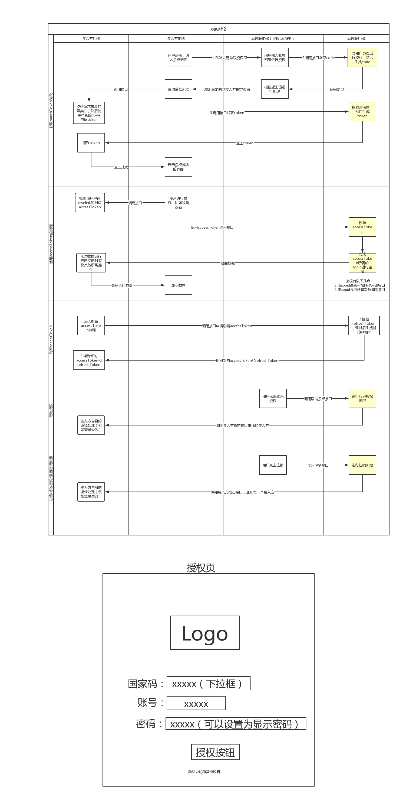
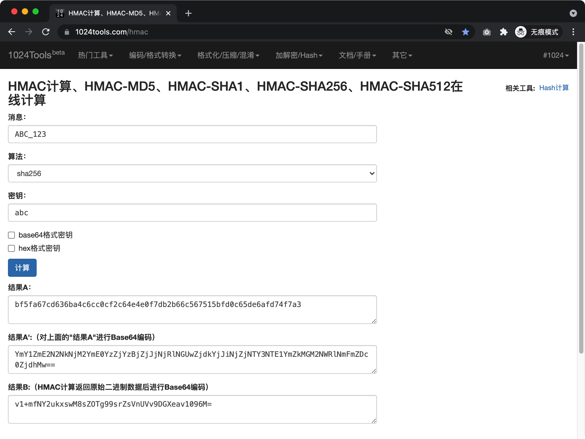
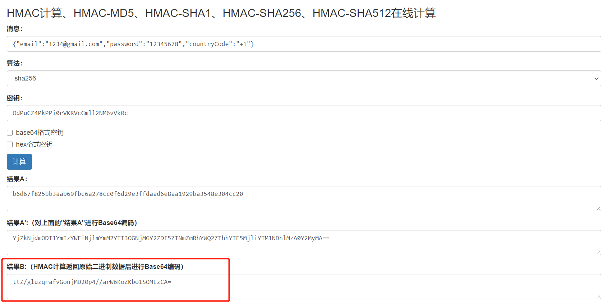

<!--

 * @Descripttion:
 * @version:
 * @Author: Carl
 * @Date: 2021-07-30 16:27:12
 * @LastEditors: Carl
 * @LastEditTime: 2021-12-29 09:06:43
   -->

# OAuth 2.0

## 准备资料

在启动对接前，您应当提供给我们以下信息：

- 应用名。必填，中英文项目名称。
- 申请人联系方式。必填，手机或者邮箱。
- 申请的角色。选填，角色对应权限，目前默认标准角色。
- 跳转地址。必填，用户登录 eWeLink 账号成功后跳转的 URL 地址。
- 通知地址。选填，用户取消账号授权后，CoolKit 通知的 URL 地址，暂未支持。
- 项目简介。必填，简单介绍一下您的项目。

登录 [易微联开发者平台](https://dev.ewelink.cc)，提交认证资料，等待审核完成，请注意免费的 APPID 存在限制，详细介绍请查阅「调用规范（重要）」章节和「收费标准」栏目。

审核完成后在 控制台->应用管理 中新建应用，然后你就可以使用相关服务和调用对应接口了。请注意：目前只允许创建一个应用。

## 接入流程

### 完整流程图



### 代码示例与测试用例

[NodeJS 获取 Token 示例](https://github.com/coolkit-carl/eWeLinkOAuthLoginDemo)

[Postman 测试用例](https://raw.githubusercontent.com/CoolKit-Technologies/eWeLink-API/main/media/files/CoolKit_OAuth2.0_Postman_Demo.zip)

导入 [Postman](https://www.postman.com/downloads/)，在环境变量中填写自己的应用信息即可使用。

### 授权页说明

URL：[https://c2ccdn.coolkit.cc/oauth/index.html](https://c2ccdn.coolkit.cc/oauth/index.html)

该授权页面文字语言显示依据：[Navigator.language](https://developer.mozilla.org/en-US/docs/Web/API/NavigatorLanguage/language)

请求方法：GET

Query 参数：

| 参数          | 是否可为空 |                                                            说明                                                             |
| ------------- | ---------: | :-------------------------------------------------------------------------------------------------------------------------: |
| clientId      |          N |                                                 接入方的 APPID，向酷宅申请                                                  |
| seq           |          N |                                                  本次请求时的毫秒级时间戳                                                   |
| authorization |          N |                                                    签名，具体算法见下文                                                     |
| redirectUrl   |          N |                                              获取授权码 code 成功后的回调地址                                               |
| grantType     |          N |          授权类型，目前这个参数内容暂时固定填「authorization_code」（即暂时只支持使用授权码的方式来进行授权操作）           |
| state         |          N | 请求标识，接入方用该变量避免跨域伪造问题，易微联服务端要求该值必传，但不校验具体值，可以传自己平台的用户的 ID，跳转时会回传 |
| nonce         |          Y |                                              8 位随机字符(大小写英文数字均可)                                               |

authorization 参数内签名计算方式：

算法：HMAC（Hash-based Message Authentication Code）SHA256

密钥：{clientSecret}
消息：{clientId}\_{seq}

结果：HMAC 计算返回原始二进制数据后进行 Base64 编码

示例：此处假设 clientId = ABC，seq = 123，clientSecret = abc

实际算出的签名是：v1+mfNY2ukxswM8sZOTg99srZsVnUVv9DGXeav1096M=



计算所得结果填入 authorization 参数内。

代码示例：

```JavaScript
// NodeJS
const crypto = require('crypto');
const clientId = 'ABC';
const seq = '123';
const clientSecret = 'abc';
const buffer = Buffer.from(`${clientId}_${seq}`, "utf-8");
const sign = crypto.createHmac("sha256", clientSecret).update(buffer).digest("base64");
console.log(sign);
// v1+mfNY2ukxswM8sZOTg99srZsVnUVv9DGXeav1096M=
```

```Python
# Python
import hashlib
import hmac
import base64

def makeSign(key:str, message:str) -> str:
    return (base64.b64encode(hmac.new(key.encode(), message.encode(), digestmod=hashlib.sha256).digest())).decode()

sign = makeSign("abc","ABC_123")
print(sign)
# v1+mfNY2ukxswM8sZOTg99srZsVnUVv9DGXeav1096M=
```

将上方参数放进 query 中得到最终的授权页地址：

接入方引导用户打开授权页地址，例如：[https://c2ccdn.coolkit.cc/oauth/index.html?state=XXX&clientId=XXX&authorization=XXX&seq=123&redirectUrl=https://XXX.com/redirect.html&nonce=zt123456&grantType=authorization_code](https://c2ccdn.coolkit.cc/oauth/index.html?state=XXX&clientId=XXX&authorization=XXX&seq=123&redirectUrl=https://XXX.com/redirect.html&nonce=zt123456&grantType=authorization_code)

用户在填写完账号密码，点击登录，登录成功后页面会跳转到您之前添加的跳转地址 URL，并携带参数 code、region、state，请求方法是 GET。

示例：{Your redirectUrl}?code=95bcf41b-3397-46da-886f-fdc852de84ca&region=as&state=10011

**code 有效期 30 秒，到期返回：{ "error": 405, "msg": "invalid code", "data": {} }**

接入方拿到 code 之后，请求对应区域的 POST@/v2/user/oauth/token 接口，获取 acessToken，完成绑定流程，后续可以使用该 Token 获取用户的设备信息，控制设备。

## v2 接口说明

本协议接口统一使用 HTTPS 协议，客户端向服务端发送数据使用 UTF-8 编码，使用 json 格式，接口调用频次存在限制。

### 调用规范（重要）

- 当用户登录易微联账号授权成功后，您的平台应当先调用一次「获取 Thing 列表」接口（GET@/v2/device/thing），同步设备列表，根据 UIID（UI 的 ID） 正常显示设备的类型。
- 单个 IP 对所有接口调用时间间隔应尽量大于等于 500ms，5 分钟内调用次数不超过 300 次，如果使用 WebSocket 方式控制我们的设备，请注意单个用户不应该短时间内反复上线（发送 userOnline 指令），短时间内上报次数过多会被服务器封锁 IP 和停用。
- 经过商务认证的合作伙伴和付费购买 APPID 的企业，使用「付费 APPID」请求所有接口总调用次数暂无限制，但对调用频次的限制和上述第二点保持一致。
- 通过易微联开发者平台登录完成认证的开发者使用的「免费 APPID」请求 OAuth2.0 相关接口，单个区域所有接口的总请求次数限制 5 万次/月，超出限额，接口返回 HTTP 状态码为 403 错误（不是返回的参数）或接口返回 412 错误，次月额度刷新可继续使用，如需立即解除限制需要付费升级为企业版，请邮件联系 bd@coolkit.cn。
- 对于企业或者个人开发者申请的 APPID，目前开放 部分已授权品牌的设备、以及主流设备类型（文档即将分批次发布，敬请期待），如需接入其他复杂设备类型或支持新设备类型，请直接联系对接业务人员或邮件联系 bd@coolkit.cn。

### v2 接口域名

- 中国: https://cn-apia.coolkit.cn
- 亚洲: https://as-apia.coolkit.cc
- 美洲: https://us-apia.coolkit.cc
- 欧洲: https://eu-apia.coolkit.cc

### v2 接口通用参数

| **Http Header** | **是否允许为空**               | **说明**                                                                                                                         |
| :-------------- | :----------------------------- | :------------------------------------------------------------------------------------------------------------------------------- |
| X-CK-Appid      | 【用户】分类下的接口不允许为空 | APPID，APP 的标识，需要付费购买的凭证                                                                                            |
| X-CK-Nonce      | 允许为空                       | 长度 8 的大小写字母和数字，客户端应尽量使用随机字符串，方便和服务端联调                                                          |
| Authorization   | 不允许为空                     | API 调用凭证，计算方法见下方 **签名规则**                                                                                        |
| Content-Type    | PUT 和 POST 的请求不允许为空   | 固定为 "application/json" 或者 "application/json; charset=utf-8"                                                                 |
| Host            | 不允许为空                     | 大部分 HTTP 客户端会自动添加此字段，如果没有，必须代码明确指定，值为对应的接口域名，比如: cn-apia.coolkit.cn, us-apia.coolkit.cc |

### v2 接口签名规则

- 未登录的所有接口（包括登录接口）调用都需要计算签名，签名值放在请求头的  **Authorization**参数中。

如: Authorization: Sign QtKh6EnKoNmPnv17Ump3b/6r2hjojWb4nqSt4lnyj2U=

计算签名:

将 "app secret" 作为 key，生成被签名串的 HMAC-SHA256 签名，将得到的签名 BASE64 编码后设置到 Authorization 头中。

- GET 请求:

将所有参数（sign 除外）按照参数名的字母顺序排序，并用&连接:

```
appid=McFJj4Noke1mGDZCR1QarGW7P9Ycp0Vr&deviceid=1000012345&nonce=2323dfgh&ts=1558004249
```

- POST 请求:

待签名字符串为整个 body 的 json 数据(接口中的参数)，以登录接口为例。

如:

```json
{ "email": "1234@gmail.com", "password": "12345678", "countryCode": "+1" }
```

**注意:**

phoneNumber 的值需要加上国家码如: +86

phoneNumber 和 email 只需要传递其中一个。中国大陆区域只能传递「phoneNumber」，亚洲区域可传「phoneNumber」或「email」，欧洲和美洲地区传递「email」。

计算签名方法:

将 "app secret" 作为 key，生成被签名串的 HMAC-SHA256 签名，将得到的签名 Base64 编码后设置到 Authorization 中。

**签名计算**

**15 种编程语言 Sha256 加密函数示例：**[https://www.jokecamp.com/blog/examples-of-creating-base64-hashes-using-hmac-sha256-in-different-languages/](https://www.jokecamp.com/blog/examples-of-creating-base64-hashes-using-hmac-sha256-in-different-languages/)

在线计算网址: [https://1024tools.com/hmac](https://1024tools.com/hmac)



- 签名算法 Demo①: 以登录接口为例，Method: POST

```JavaScript
// node.js
var crypto = require('crypto');
let appsecret="OdPuCZ4PkPPi0rVKRVcGmll2NM6vVk0c";
let body={"email":"1234@gmail.com","password":"12345678","countryCode":"+1"}
let buffer = Buffer.from(JSON.stringify(body),"utf-8" );
let theSign = crypto.createHmac('sha256', appsecret).update(buffer).digest('base64')
// or let theSign = CryptoJS.enc.Base64.stringify(CryptoJS.HmacSHA256(buffer, appsecret));
console.log(theSign)
// ttZ/gluzqrafvGonjMD20p4//arW6KoZKbo1SOMEzCA=
```

- 签名算法 Demo②:

```Python
# Python
# 生成签名
import hashlib
import hmac
import base64
import json

def makeSign(key, message):
    j = hmac.new(key.encode(), message.encode(), digestmod=hashlib.sha256)
    return (base64.b64encode(j.digest())).decode()

def main():
    data = {
        "email":"1234@gmail.com",
        "password":"12345678",
        "countryCode":"+1"
    }
    message = json.dumps(data) # 此处会排序
    Sign = makeSign(key='OdPuCZ4PkPPi0rVKRVcGmll2NM6vVk0c', message=message)
    print(Sign)
    # cE/Wl57Ithy21Elieq5wFsYwJWl2IrkBxlmuCnwI73c=

if __name__ == "__main__":
    main()
```

备注: 由于签名内容字符顺序不同，得到的签名也会不同，这个是正常的。

可以拿 demo 的参数放到自己的签名算法中，算出来的签名值和提供的签名值一致，表示签名算法通过。

### v2 接口返回格式

本协议所有接口返回的数据都使用 UTF-8 编码，使用 json 格式。数据格式如下

| **名称** | **类型** | **允许为空** | **说明**                                                                                                         |
| :------- | :------- | :----------- | :--------------------------------------------------------------------------------------------------------------- |
| error    | Int      | N            | 错误码，0 代表无错误，1000 以内为通用错误码，参见本协议的【通用错误码】部分，1000 以上的错误码由不同接口给出定义 |
| data     | Object   | N            | 接口数据                                                                                                         |
| msg      | String   | N            | 错误信息，error=0 时为空字符串""，其它情况根据不同接口给出，以便调试                                             |

举例 1: 接口成功返回

```json
{
  "error": 0,
  "msg": "",
  "data": {
    "data1": "xxx",
    "data2": "yyy"
  }
}
```

举例 2: 接口错误返回

```json
{
  "error": 403,
  "msg": "api not found",
  "data": {}
}
```

## v2 接口错误码

| **错误码** | **说明**                                                                                                 |
| :--------- | :------------------------------------------------------------------------------------------------------- |
| 400        | 参数错误，通常是缺少接口必须的参数，或者参数的类型或值错误                                               |
| 401        | access token 认证错误，通常是账号被其他人登录，导致当前 access token 失效                                |
| 402        | access token 过期                                                                                        |
| 403        | 找不到接口，通常是接口 url 写错                                                                          |
| 405        | 找不到资源，通常是在后端数据库中查不到必需的数据记录                                                     |
| 406        | 拒绝操作，通常是当前用户无权操作指定资源                                                                 |
| 407        | appid 无操作权限 |
| 412        | APPID调用次数超过限制，可邮件联系 bd@coolkit.cn 升级至企业版 |
| 500        | 服务器内部错误，通常是服务端的程序出错                                                                   |
| 4002       | 设备控制失败（检查控制传参或设备在线状态） |
| 30022      | 设备已离线，操作失败，批量更新设备状态中会出现                                                           |

## v2 接口清单


### 申请第三方授权凭证

URL：/v2/user/oauth/token

认证参数：Sign

请求方法：POST

请求参数：

| **名称**    | **类型** | **允许空** | **说明**                          |
| ----------- | -------- | ---------- | --------------------------------- |
| code        | String   | N          | 授权码                            |
| redirectUrl | String   | N          | 回调地址                          |
| grantType   | String   | N          | 目前暂时固定为 authorization_code |

响应 data 参数：

| **名称**      | **类型** | **允许空** | **说明**                               |
| ------------- | -------- | ---------- | -------------------------------------- |
| accessToken   | String   | N          | 授权凭证                               |
| atExpiredTime | Int      | N          | 授权凭证的过期时间戳（毫秒）           |
| refreshToken  | String   | N          | 刷新授权凭证的凭证                     |
| rtExpiredTime | Int      | N          | 刷新授权凭证的凭证的过期时间戳（毫秒） |

### 刷新 Token

接口：/v2/user/refresh

认证参数：accessToken

请求方法：POST

请求参数:

| **名称** | **类型** | **允许为空** | **说明**      |
| :------- | :------- | :----------- | :------------ |
| rt       | String   | N            | Refresh Token |

响应 data 参数:

| **名称** | **类型** | **允许为空** | **说明**                    |
| :------- | :------- | :----------- | :-------------------------- |
| at       | String   | N            | Access Token，有效期 30 天  |
| rt       | String   | N            | Refresh Token，有效期 60 天 |

### 取消第三方账号绑定

接口：/v2/user/oauth/token

认证参数：accessToken

请求方法：DELETE

请求参数：无

响应 data 参数：无

### 获取家庭和房间列表

接口：/v2/family

认证参数：accessToken

请求方法：GET

请求参数：

| **名称** | **类型** | **允许为空** | **说明**                                  |
| :------- | :------- | :----------- | :---------------------------------------- |
| lang     | String   | Y            | cn 返回中文信息，en 返回英文信息，默认 en |

响应 data 参数:

| **名称**        | **类型** | **允许为空** | **说明**          |
| :-------------- | :------- | :----------- | :---------------- |
| familyList      | Array    | N            | 家庭列表          |
| currentFamilyId | String   | N            | 当前所在家庭的 id |

familyList 列表 item 说明:

| **名称** | **类型** | **允许为空** | **说明**                |
| :------- | :------- | :----------- | :---------------------- |
| id       | String   | N            | 家庭 id                 |
| apikey   | String   | N            | 用户 apikey             |
| name     | String   | N            | 家庭名称                |
| index    | Int      | N            | 家庭排序号 可能存在负数 |
| roomList | Array    | Y            | 房间列表                |

roomList 列表 item 说明:

| **名称** | **类型** | **允许为空** | **说明**                |
| :------- | :------- | :----------- | :---------------------- |
| id       | String   | N            | 房间 id                 |
| name     | String   | N            | 房间名称                |
| index    | Int      | N            | 房间排序号 可能存在负数 |

### 获取 Thing 列表

**注意：**

- 当用户设备（total 参数）超过 30，需要设置 beginIndex 参数分页获取，否则获取数据过多，服务端会返回 500 等超时错误。
- 返回的 total 参数可能大于返回的设备数据总额，说明未获取到所有设备数据，具体原因是：目前我们只授权了松诺和酷宅的品牌，其他厂商的品牌需要在我们业务同事的帮助下签订授权书才能使用，详见「接口中心\_v2->调用规范（重要）」章节。
- 如果因为业务关系，需要用到多个易微联账号，但没有资源建立多个长连接，建议把其他账号的设备都分享到一个特定易微联账号，然后建立这个账号的长连接，被动接收消息，减少接口调用轮询。

接口：/v2/device/thing

认证参数：accessToken

请求方法：GET

说明: Thing 包括

- 设备（自己的和别人分享的）
- 设备群组

请求参数:

| **名称**   | **类型** | **允许为空** | **说明**                                         |
| :--------- | :------- | :----------- | :----------------------------------------------- |
| lang       | String   | Y            | cn 返回中文信息，en 返回英文信息，默认 en        |
| familyid   | String   | Y            | 家庭 id，不填则默认为当前家庭                    |
| num        | Int      | Y            | 获取的数量，默认为 30 0 表示获取所有             |
| beginIndex | Int      | Y            | 从哪个序号开始获取列表数据，不填则默认为-9999999 |

响应 data 参数:

| **名称**  | **类型** | **允许为空** | **说明**                      |
| :-------- | :------- | :----------- | :---------------------------- |
| thingList | Array    | N            | Thing 列表                    |
| total     | Int      | N            | Thing 总数量（设备+设备群组） |

thingList 列表 item 说明:

| **名称** | **类型** | **允许为空** | **说明**                                                                                                             |
| :------- | :------- | :----------- | :------------------------------------------------------------------------------------------------------------------- |
| itemType | Int      | N            | item 的类型 1=用户自己的设备 2=别人分享的设备 3=自己的群组                                                           |
| itemData | Object   | N            | 根据 itemType 有不同的结构 1 和 2 时参见下方 item 说明 3 时参见【获取设备群组列表】接口中的 groupList 列表 item 说明 |
| index    | Int      | N            | 排序号                                                                                                               |

item 说明：

| **名称**     | **类型**        | **允许空** | **说明**                                                  |
| :----------- | :-------------- | :--------- | :-------------------------------------------------------- |
| name         | String          | N          | 设备名称                                                  |
| deviceid     | String          | N          | 设备 ID                                                   |
| apikey       | String          | N          | 设备所属用户的 apikey                                     |
| extra        | Object          | N          | factoryDevice 的 extra 字段中的内容                       |
| brandName    | String          | N          | 品牌名称                                                  |
| brandLogo    | String          | N          | 品牌 Logo url                                             |
| showBrand    | Boolean         | N          | 是否显示品牌                                              |
| productModel | String          | N          | 产品型号名称                                              |
| devGroups    | Array\<Object\> | Y          | 设备所属的群组信息列表                                    |
| tags         | Object          | Y          | 标签对象，里面是存储的是自定义字符串，服务器只负责透传    |
| devConfig    | Object          | Y          | 设备端配置信息，来源于 factorydevices 表的 deviceConfig。 |
| settings     | Object          | Y          | 用户设置，参见【修改设备配置】接口说明                    |
| family       | Object          | N          | 设备的家庭设置                                            |
| sharedBy     | Object          | Y          | 如果设备是别人分享过来的，就会有该属性。                  |
| shareTo      | Array\<Object\> | Y          | 被分享用户的列表，表示用户把设备分享给了哪些人。          |
| devicekey    | String          | N          | 设备的出厂 apikey                                         |
| online       | Boolean         | N          | 在线状态                                                  |
| params       | Object          | Y          | 设备的状态属性                                            |
| gsmInfoData  | Object          | Y          | GSM 设备的卡状态对象                                      |

extra 说明：

| **名称**     | **类型** | **允许空** | **说明**                      |
| :----------- | :------- | :--------- | :---------------------------- |
| model        | String   | N          | 固件名称                      |
| ui           | String   | N          | UI 的名称                     |
| uiid         | Int      | N          | UI 的 ID                      |
| description  | String   | N          | 出厂信息备注，一般是订单号    |
| manufacturer | String   | N          | 制造商                        |
| mac          | String   | N          | mac 地址                      |
| apmac        | String   | N          | ap mac 地址（设备热点的地址） |
| modelInfo    | String   | N          | 产品型号 ID                   |
| brandId      | String   | N          | 品牌 ID                       |

settings 说明:

| **名称**    | **类型** | **允许为空** | **说明**                                       |
| :---------- | :------- | :----------- | :--------------------------------------------- |
| opsNotify   | Int      | Y            | 操作变化是否通知用户（默认 0）0=不通知  1=通知 |
| opsHistory  | Int      | Y            | 是否记录操作历史（默认 1）0=不记录  1=记录     |
| alarmNotify | Int      | Y            | 是否发送告警信息（默认 1）0=不发送  1=发送     |

devGroups 说明：

| **名称** | **类型** | **允许空** | **说明**       |
| :------- | :------- | :--------- | :------------- |
| type     | Int      | N          | 1 代表设备群组 |
| groupId  | String   | N          | 所属群组的 id  |

sharedBy 列表 item 说明：

| **名称**    | **类型** | **允许空** | **说明**                                           |
| :---------- | :------- | :--------- | :------------------------------------------------- |
| apikey      | String   | N          | 设备所属用户的唯一标识（目前使用对称加密该字符串） |
| permit      | Int      | N          | 用户的权限值，默认为 0                             |
| phoneNumber | String   | Y          | 设备所属用户手机号                                 |
| email       | String   | Y          | 设备所属用户 email                                 |
| nickname    | String   | Y          | 设备所属用户的昵称                                 |
| comment     | String   | Y          | 分享时的备注                                       |
| shareTime   | Long     | Y          | GMT 标准时间，毫秒数，主要用来在客户端显示排序。   |

shareTo 列表 item 说明：

| **名称**    | **类型** | **允许空** | **说明**                                                   |
| :---------- | :------- | :--------- | :--------------------------------------------------------- |
| permit      | Int      | N          | 用户的权限值，默认为 0                                     |
| apikey      | String   | N          | 接收设备分享的用户账号 ID 标识（目前使用对称加密该字符串） |
| phoneNumber | String   | Y          | 设备所属用户手机号                                         |
| email       | String   | Y          | 设备所属用户 email                                         |
| nickname    | String   | Y          | 设备所属用户的昵称                                         |
| comment     | String   | Y          | 分享时的备注                                               |
| shareTime   | Long     | Y          | GMT 标准时间，毫秒数，主要用来在客户端显示排序。           |

devConfig 说明（摄像头相关）：

| **名称**      | **类型** | **允许空** | **说明**   |
| :------------ | :------- | :--------- | :--------- |
| p2pServerName | String   | Y          | 服务器名称 |
| p2pAccout     | String   | Y          | 账号       |
| p2pLicense    | String   | Y          | license    |

family 说明：

| **名称** | **类型** | **允许空** | **说明**                |
| :------- | :------- | :--------- | :---------------------- |
| familyid | String   | N          | 家庭 id                 |
| index    | Int      | N          | 设备排序号 可能存在负数 |
| roomid   | String   | Y          | 所属房间 id             |

### 获取指定 Thing 列表信息

接口：/v2/device/thing

认证参数：accessToken

请求方法：POST

请求参数：

| **名称**  | **类型** | **允许为空** | **说明**                                             |
| :-------- | :------- | :----------- | :--------------------------------------------------- |
| thingList | Array    | N            | 需要获取的 thing 列表列表数量必须大于 0，小于等于 10 |

thingList item 说明:

| **名称** | **类型** | **允许为空** | **说明**                                                                              |
| :------- | :------- | :----------- | :------------------------------------------------------------------------------------ |
| itemType | Int      | N            | item 的类型 1=用户自己的设备 2=别人分享的设备 3=自己的群组                            |
| id       | String   | N            | thing 对应的 id,itemType 为 1 或 2 时为设备的 deviceid,itemType 为 3 或 4 时为群组 id |

响应 data 参数:

| **名称**  | **类型** | **允许为空** | **说明**                                        |
| :-------- | :------- | :----------- | :---------------------------------------------- |
| thingList | Array    | N            | Thing 列表信息，参见【获取 thing 列表】中的说明 |

### 获取设备或群组的状态

建议使用长连接被动接收设备状态更新。减少轮询，避免频繁请求本接口。

接口：/v2/device/thing/status

认证参数：accessToken

请求方法：GET

请求参数:

| **名称** | **类型** | **允许为空** | **说明**                                      |
| :------- | :------- | :----------- | :-------------------------------------------- |
| type     | Int      | N            | 要获取设备还是群组 1=设备 2=群组              |
| id       | String   | N            | type=1 时为设备的 deviceid type=2 时为群组 id |
| params   | String   | Y            | 需要获取的状态参数                            |

**params 说明**

调用方可以指定只获取特定的状态参数，以"|"间隔，再做 URL 转换。

举例: 想要得到 switch 和 light 两个状态

1. 构造字符串 switch|light
2. 对(1)的字符串做 URL 转换，得到字符串 switch%7Clight，即为发送给接口 params 参数的值

如果要获取设备或群组所有的状态，params 参数为空即可

响应 data 参数:

| **名称** | **类型** | **允许为空** | **说明**             |
| :------- | :------- | :----------- | :------------------- |
| params   | Object   | N            | 设备或群组的状态属性 |

### 更新设备或群组的状态

建议使用长连接下发控制指令。

URL: /v2/device/thing/status

认证参数：accessToken

请求方法：POST

请求参数:

| **名称** | **类型** | **允许为空** | **说明**                                      |
| :------- | :------- | :----------- | :-------------------------------------------- |
| type     | Int      | N            | 要更新设备还是群组 1=设备 2=群组              |
| id       | String   | N            | type=1 时为设备的 deviceid type=2 时为群组 id |
| params   | Object   | N            | 更新的状态参数                                |

**params 说明**

- 更新设备时，会向设备下发控制指令，如果设备不在线或发送失败，会返回错误
- 更新群组时，会向群组下的所有设备发送控制指令，并忽略设备不在线或发送失败的情况

响应 data 参数: 无

### 批量更新设备或群组的状态

说明：该接口会实际向设备下发控制指令，是为不能走长连接更新状态的设备准备的

接口：/v2/device/thing/batch-status

认证参数：accessToken

请求方法：POST

请求参数：

| **名称**  | **类型**        | **允许为空** | **说明**                                                                                   |
| :-------- | :-------------- | :----------- | :----------------------------------------------------------------------------------------- |
| thingList | Array\<Object\> | N            | 要更新的 thing 列表，长度大于 0，小于等于 10，客户端需保证列表中的 id 是唯一的，否则报错   |
| timeout   | Int             | Y            | 等待所有设备响应的时间，单位毫秒， 0 <= timeout <= 8000 ，如果不填则默认为 0，表示立即返回 |

thingList 列表中 item 的说明:

| **名称** | **类型** | **允许为空** | **说明**                                       |
| :------- | :------- | :----------- | :--------------------------------------------- |
| type     | Int      | N            | 要更新设备还是群组，1=设备 2=群组              |
| id       | String   | N            | type=1 时为设备的 deviceid，type=2 时为群组 id |
| params   | Object   | N            | 要更新的状态参数                               |

响应 data 参数：

| **名称** | **类型**        | **允许为空** | **说明**                  |
| :------- | :-------------- | :----------- | :------------------------ |
| respList | Array\<Object\> | N            | 每个 thing 的响应结果列表 |

respList 列表中 item 的说明:

| **名称** | **类型** | **允许为空** | **说明**                                                                                          |
| :------- | :------- | :----------- | :------------------------------------------------------------------------------------------------ |
| type     | Int      | N            | 要更新设备还是群组，1=设备 2=群组                                                                 |
| id       | String   | N            | type=1 时为设备的 deviceid，type=2 时为群组 id                                                    |
| error    | Int      | N            | 响应错误码，0 代表无错误如果 type=2，则 error 固定为 0 如果调用时 timeout 为 0，则 error 固定为 0 |

## 实时设备控制

**我们推荐使用使用这种方式实时管理和控制设备，这样可以避免频繁请求接口对服务器造成压力。**

完整流程说明：

客户端（APP、小程序、Web 网页或者其他）请求分配服务接口，获取建立 Websocket 的 IP 地址+端口。

拼接 wss 地址：wss:// {domain 或 IP}:{port}/api/ws

建立连接后，发送 WebSocket：握手相关参数，通过认证后，就成功建立连接了，然后就可以下发控制指令和接收设备或者服务端上报信息。

### HTTP : 分配服务（APP）

App 使用的长连接分配地址接口

- 中国: [https://cn-dispa.coolkit.cn/dispatch/app](https://cn-dispa.coolkit.cn/dispatch/app)
- 美洲: [https://us-dispa.coolkit.cc/dispatch/app](https://us-dispa.coolkit.cc/dispatch/app)
- 欧洲: [https://eu-dispa.coolkit.cc/dispatch/app](https://eu-dispa.coolkit.cc/dispatch/app)
- 亚洲: [https://as-dispa.coolkit.cc/dispatch/app](https://as-dispa.coolkit.cc/dispatch/app)

中国境内微信使用的长连接分配地址接口：https://wx-disp.coolkit.cn:8080/dispatch/app

请求方法：GET

认证方式：无

请求参数：无

说明：请注意中国区和测试区使用的域名是 coolkit.**cn**，而海外区使用的域名是 coolkit.**cc**

**响应参数：**

| 名称   | 类型   | 允许为空 | 说明                                                                                                                                                                      |
| :----- | :----- | :------- | :------------------------------------------------------------------------------------------------------------------------------------------------------------------------ |
| IP     | string | N        | 长连接服务器外网 IP                                                                                                                                                       |
| port   | number | N        | 长连接服务器外网端口                                                                                                                                                      |
| domain | string | N        | 长连接服务器域名。目前只有 app 端才会返回域名。android 客户端尽量选择用 ip 建立长连接，这样可以减少 dns 解析带来的问题，js 版客户端无法跳过证书检查，那么就只能用 IP 了。 |
| error  | number | N        | 成功返回 error:0                                                                                                                                                          |
| reason | string | N        | 成功返回 ok                                                                                                                                                               |

错误码：

0: 成功

**返回示例：**

```json
{
  "port": 8080,
  "IP": "52.80.19.131",
  "reason": "ok",
  "domain": "cn-pconnect2.coolkit.cc",
  "error": 0
}
```

### WebSocket：握手

连接建立时的认证，握手分客户端和设备端，此处为客户端的握手。

**注意：**

建立 wss 连接的时候，客户端会校验访问的域名与证书的域名是否一致，所以默认情况下如果用 ip 建立连接，会报错，导致建立连接失败。

所以建议客户端跳过证书的域名校验（android 和 java 都可以跳过）。 如果无法跳过证书校验，那么就只能用 IP 去建立 wss 连接了。

从【HTTP : 分配服务】获取到要连接的长连接地址，拼接成：wss://IP:端口/api/ws，建立长连接。

握手成功后需要定期（时间间隔见 hbInterval 字段）发送字符串 ping 到服务器，保持心跳，否则会被服务器强制下线。

以下为参数:

| 名称      | 类型   | 允许为空 | 说明                            |
| :-------- | :----- | :------- | :------------------------------ |
| action    | string | N        | 固定参数: userOnline            |
| at        | string | N        | 登录接口获取的 AT               |
| apikey    | string | N        | 用户 apikey（可从登陆接口获取） |
| appid     | string | N        | APPID                           |
| nonce     | string | N        | 8 位字母数字随机数              |
| ts        | number | Y        | 时间戳精确到秒                  |
| userAgent | string | N        | 固定参数: app                   |
| sequence  | string | N        | 时间戳精确到毫秒                |
| version   | number | N        | 接口版本: 8                     |

示例：

```json
{
  "action": "userOnline",
  "version": 8,
  "ts": 1571141259,
  "at": "登录接口获取的AT",
  "userAgent": "app",
  "apikey": "登录接口获取的用户APIKEY",
  "appid": "McFJj4Noke1mGDZCR1QarGW7P9Ycp0Vr",
  "nonce": "2plz69ax",
  "sequence": "毫秒级时间戳，示例：1571141530100"
}
// 需去掉空格压缩, 不要带多余的逗号
```

**响应参数：**

| 名称     | 类型   | 允许为空 | 说明             |
| :------- | :----- | :------- | :--------------- |
| error    | number | N        | 错误码           |
| apikey   | string | N        | 用户 apikey      |
| config   | string | Y        | 配置信息         |
| sequence | string | N        | 时间戳精确到毫秒 |

Config 说明:

| 名称       | 类型   | 允许为空 | 说明                                                                                                                  |
| :--------- | :----- | :------- | :-------------------------------------------------------------------------------------------------------------------- |
| hb         | number | Y        | 心跳开关，是否需要发送心跳。0: 不需要， 1: 需要                                                                       |
| hbInterval | number | Y        | 心跳间隔，以秒为单位，客户端可以把这个值减上 7 作为间隔时间发送保持存活 ping 心跳，如果为空，默认以 90 秒为间隔发送。 |

易微联客户端的做法是：间隔时间 = config.hbInterval * random(0.8, 1); // 返回时间*0.8 到 1.0 的随机数

错误码：

0: 成功

**返回示例：**

```json
{
  "error": 0,
  "apikey": "用户APIKEY",
  "config": {
    "hb": 1,
    "hbInterval": 145
  },
  "sequence": "毫秒级时间戳，示例：1571141530100" // 和发送的一样
}
```

### WebSocket: 设备上线离线通知（APP 接收即可）

服务端检测到设备上线或者下线以后，会向 app 发送通知指令，该指令 app 端是**被动接收，不需要客户端主动发送**。

参数:

| 名称     | 类型   | 允许为空 | 说明                            |
| :------- | :----- | :------- | :------------------------------ |
| action   | string | N        | 固定参数: sysmsg                |
| apikey   | string | N        | 用户 apikey（可从登陆页面获取） |
| nonce    | string | N        | 8 位字母数字随机数              |
| ts       | number | Y        | 时间戳精确到秒，                |
| deviceid | string | N        | 设备 ID                         |
| params   | object | N        | 参数: {k:v}                     |

示例：

```json
{
  "action": "sysmsg",
  "deviceid": "1000000001",
  "apikey": "用户APIKEY",
  "ts": 15452192511,
  "params": {
    "online": false
  }
}
```

### WebSocket: 更新设备状态

**设备状态改变上报 update 指令后，只要客户端建立了长连接，就可以收到信息，所以建议客户端保持长连接监测设备状态或者发送查询指令获取单个设备状态，而不是定时请求 HTTP 接口获取设备状态，避免对服务器造成较大的负担。**

更改设备的状态，比如: 定时器、分享、开关状态等。

参数:

| 名称       | 类型   | 允许为空 | 说明                                                                                         |
| :--------- | :----- | :------- | :------------------------------------------------------------------------------------------- |
| action     | string | N        | 固定参数: update                                                                             |
| apikey     | string | N        | 用户 apikey（可从登陆接口获取）或 主人账号的 apikey（可从获取 Thing 列表接口中获取）         |
| selfApikey | string | Y        | 接收方的 apikey ，接收方更新设备状态时，该字段必传，不允许为空                               |
| deviceid   | string | N        | 设备 ID                                                                                      |
| params     | object | N        | 服务端对于 params 参数采用透传方式，可能是对象也可能是对象数组。只需要发送期望改变的状态参数 |
| userAgent  | string | N        | app 或者 device                                                                              |
| sequence   | string | N        | 时间戳精确到毫秒                                                                             |

示例：

```json
{
  "action": "update",
  "deviceid": "100000001",
  "apikey": "当前用户APIKEY",
  "userAgent": "app",
  "sequence": "1585297259553",
  "params": {
    "switch": "on" // 单通道设备
  }
}
```

如若更新其他用户分享给自己的设备状态：

```json
{
  "action": "update",
  "deviceid": "100000001",
  "apikey": "主人账号的APIKEY",
  "selfApikey": "接收方账号的APIKEY",
  "userAgent": "app",
  "sequence": "1585297259553",
  "params": {
    "switch": "on" // 单通道设备
  }
}
```

params 说明:

此参数内容来自于协议文档，不同设备不同协议内容，比如 单通道开关只有一个 switch，但多通道设备肯定不止一个 switch，灯类设备还能调色调光，参数也有所不同。

协议文档需要向对接销售获取，公版易微联 APP 未对接设备（无 UI）的，如果定制界面需要额外付费，具体情况可咨询对接销售。

**响应参数：**

| 名称     | 类型   | 允许为空 | 说明             |
| :------- | :----- | :------- | :--------------- |
| error    | number | N        | 错误码           |
| apikey   | string | Y        | 用户 apikey      |
| deviceid | string | Y        | 设备 ID          |
| sequence | string | N        | 时间戳精确到毫秒 |

示例：

```json
{
  "error": 0,
  "deviceid": "1000000001",
  "apikey": "***************",
  "sequence": "1585297259553"
}
```

错误码：

504: 设备未回应（离线或者指令错误）

**定时器设置**

总体说明，设备可以添加多个定时器，每一次新增、修改、删除定时器的时候，都要全量提交定时器数组。

比如目前定时器有两个，那么如果再新增一个，那么提交的 timers 数组里，除了新增的这个定时器信息以外还要包含之前那两个定时器的信息。

timers 参数说明：

| 名称               | 类型   | 允许为空 | 说明                                                                          |
| :----------------- | :----- | :------- | :---------------------------------------------------------------------------- |
| enabled            | number | N        | 是否启用: 0 表示禁用；1 表示启用                                              |
| mId                | string | N        | 定时标记，可以理解为该定时器的 ID，不能重复，UUID 格式，可以使用库生成        |
| type               | string | N        | 设备端使用，单次定时 once；重复定时 repeat；循环定时 duration；               |
| coolkit_timer_type | string | N        | 客户端使用，单次定时 once；重复定时 repeat；循环定时 duration；延时定时 delay |
| at                 | string | N        | 执行时间: 格林尼治时间，也可采用 UTC 时间                                     |
| do                 | object | Y        | 要执行的动作                                                                  |
| startDo            | object | Y        | 循环定时专用: 周期开始要执行的动作                                            |
| endDo              | object | Y        | 循环定时专用: 随后再执行的动作                                                |
| period             | string | Y        | 延时定时专用: 延时时间，单位为分钟                                            |

示例：

单次定时，也就是只会执行一次:

```json
"params":{
        "timers":[
            {
                "enabled":1, //1表示启用
                "mId":"c102f00f-db6f-fef0-f296-9dd10fdc2193", //UUID格式，可以用库生成，给app用来标记
                "type":"once",  //设备端专用once表示单次定时，repeat重复定时
                "at":"2017-07-24T08:28:00.000Z", //执行的时间 ，注意是GTM时间   0时区
                "do":{   //具体要执行的操作
                    "switch":"on"   //这里是执行打开单通道开关的操作。如果是多通道，这里放的是多通道的开关格式。
                },
                "coolkit_timer_type":"once" //app专用
            }
        ]
    }
```

重复定时:

```json
"params":{
        "timers":[
            {
                "enabled":1,
                "mId":"847b296e-9043-ac94-ca37-aa5f91d22338",
                "type":"repeat", //重复执行
                "at":"36 8 * * 1,3",//时间表达式参考cron
                "do":{
                    "switch":"on"
                },
                "coolkit_timer_type":"repeat" //重复执行
            }
        ]
    }
```

循环定时:

```json
"params":{
        "timers":[
            {
                "enabled":1,
                "mId":"847b296e-9043-ac94-ca37-aa5f91d22338",
                "type":"duration",
                "at":"2018-11-21T10:24:00.980Z 10 5",//循环定时执行时间 循环周期 10分钟 再执行 5分钟
                "startDo":{
                    "switch":"on"  //周期开始执行
                },
                "endDo":{
                    "switch":"off"  //随后再执行
                },
                "coolkit_timer_type":"duration" //重复执行
            }
        ]
    }
```

延时定时（指定在多少分钟后执行，也就是单次执行，只是为了可以快速添加定时器）:

```json
"params":{
        "timers":[
            {
                "enabled":1,
                "mId":"95303c64-fbb4-f497-1341-c592432d1d0d",
                "type":"once",
                "at":"2017-07-24T09:10:43.223Z",
                "do":{
                    "switch":"on"
                },
                "period":"30",
                "coolkit_timer_type":"delay"  //延时定时
            }
        ]
    }
```

### WebSocket: 查询设备状态

查询设备的状态，比如: 定时器、分享、开关状态等。

参数:

| 名称      | 类型   | 允许为空 | 说明                                                   |
| :-------- | :----- | :------- | :----------------------------------------------------- |
| action    | string | N        | 固定参数: query                                        |
| apikey    | string | N        | 当前用户 apikey（可从登陆页面获取）                    |
| deviceid  | string | N        | 设备 ID                                                |
| params    | array  | N        | 字符串数组，指定要查询的参数。如果为空表示查询所有参数 |
| userAgent | string | N        | app 或者 device                                        |
| sequence  | string | N        | 时间戳精确到毫秒                                       |

示例：

```json
{
  "action": "query",
  "deviceid": "1000000001",
  "apikey": "当前用户APIKEY",
  "sequence": "1585297259553",
  "params": ["switch", "timers"], // 如果返回为空，可以使用[]查询所有字段状态
  "userAgent": "app"
}
```

如若查询其他用户分享给自己的设备状态：

```json
{
    "action":"query",
    "userAgent":"app",
    "apikey":"主人账号APIKEY",
    "deviceid":"1000000001",
    "params":["switch","timers"],
    "sequence":"1585297259553",
    "selfApikey":"当前用户APIKEY"}
}
```

params 说明:

此参数内容来自于协议文档，不同设备不同协议内容，比如 单通道开关只有一个 switch，但多通道设备肯定不止一个 switch，灯类设备还能调色调光，参数也有所不同。

协议文档需要向对接销售索要，公版易微联 APP 未对接设备（无 UI）的，如果定制需要额外付费，具体内容咨询对接销售。

**响应参数：**

| 名称     | 类型   | 允许为空 | 说明                    |
| :------- | :----- | :------- | :---------------------- |
| error    | number | N        | 错误码                  |
| apikey   | string | N        | 用户 apikey             |
| deviceid | string | N        | 设备 ID                 |
| params   | object | N        | 透传参数,服务端不做验证 |

示例：

```json
{
    "error":0,
    "deviceid":"1000000001",
    "apikey":"***************",
    "params":{
        "switch":"on",
      ...
    }
}
```
